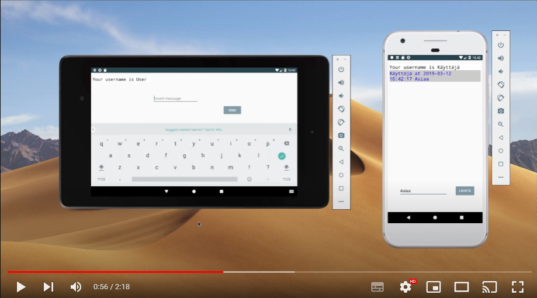

# Chattihuone - Serveri ja client

Android-sovellus, joka ohjelmoitu Kotlinilla.

Viestien lähetys ja vastaanotto useiden laitteiden välillä
Toimii pystyasennossa ja vaakatasossa
Kielet suomi ja englanti
Automaattinen rekisteröityminen
Viestien muotoilu
Automaattinen ruudunpäivitys ja viestilistan liikuttaminen
Tekstikomennot:
:history = 10 edellistä viestiä
:users = käyttäjälista

Client käyttää osittain MVC mallia. Recyclerview esimerkiksi saa datansa toisen 
classin metodista ja päivittää sen käyttöliittymään, toimien controllerina. Toisaalta viestien lähetys tapahtuu yhden classin sisällä, eikä noudata MVC 
mallia.

